# Getting Started

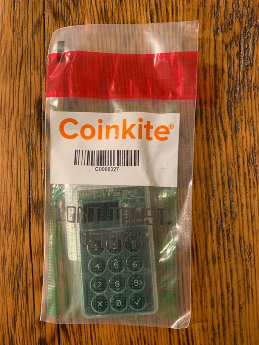

@COLDCARDwallet has implemented BIP85 in their latest firmware release. Because they're awesome. And they have the coolest gear. So get one for yourself, open the tamper-evident packaging, plug it into your [@usbCOLDPOWER](https://twitter.com/usbCOLDPOWER) and follow along.

Why use @usbCOLDPOWER you ask? Because computers are full of malware and viruses and shit. We're talking about bitcoin here, the best asset the world has ever seen. It's not worth the risk. Keep your private keys off-line. Get a cool case from [@CryptoCloaks](https://twitter.com/CryptoCloaks).

  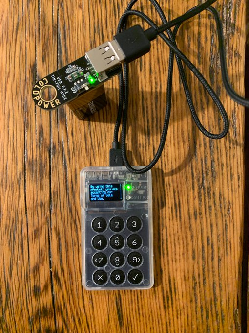
  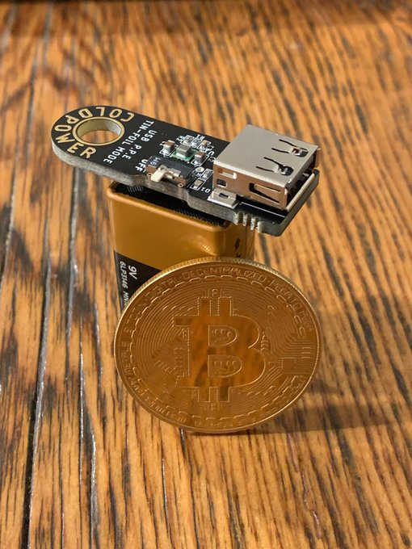
  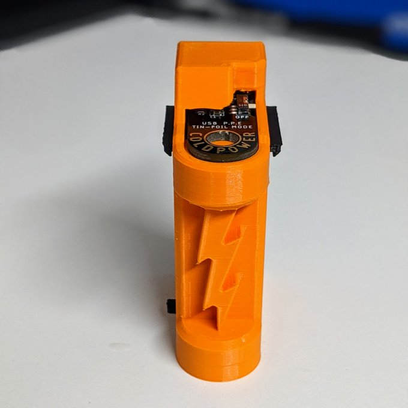

Power up your @COLDCARDwallet. Accept the terms. Confirm the bag number matches the number on the screen. Set a PIN code, they are two part PINs. CC will generate two anti-phishing words that are displayed when you login. Write all that down & secure it. Turn off/on. Confirm it works.

  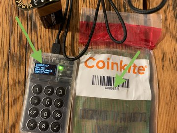
  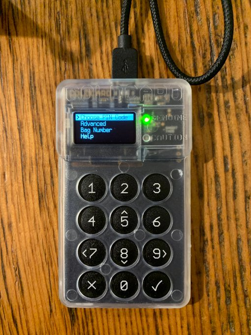
  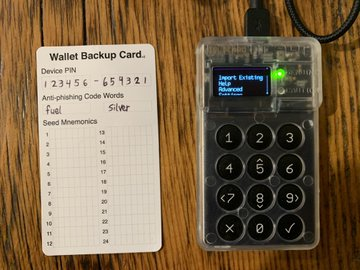
  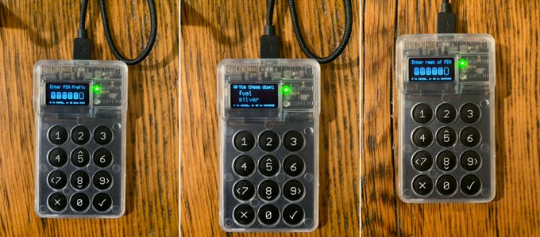

Make sure the firmware is up to date. Download it to a microSD card from: https://coldcardwallet.com/docs/upgrade

Always verify the file's signature from: https://raw.githubusercontent.com/Coldcard/firmware/master/releases/signatures.txt

Put the microSD in @COLDCARDwallet & go to Advanced>Upgrade>From MicroSD. log back in. HxD works well for checksums

  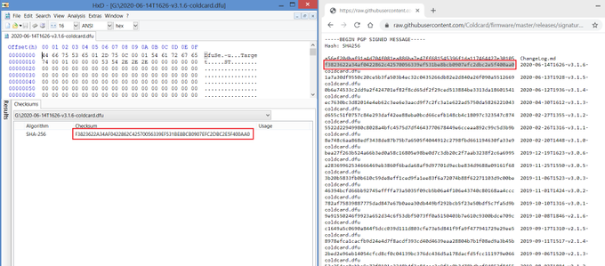
  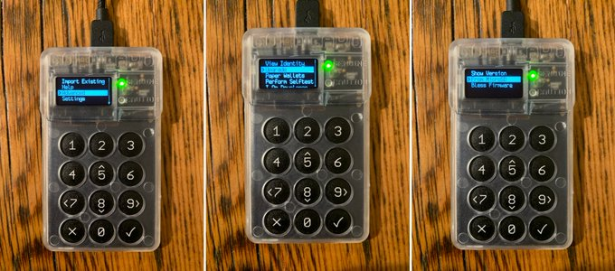
  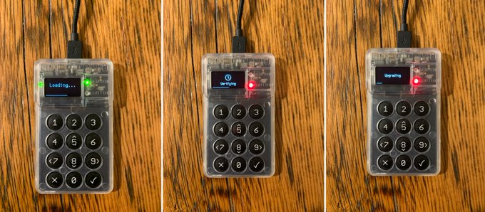

