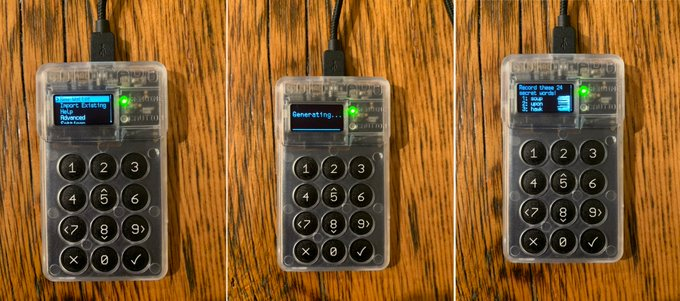
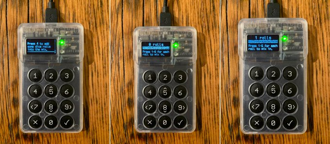
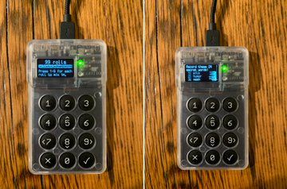
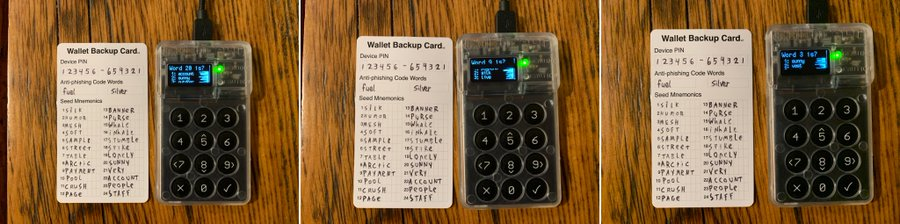
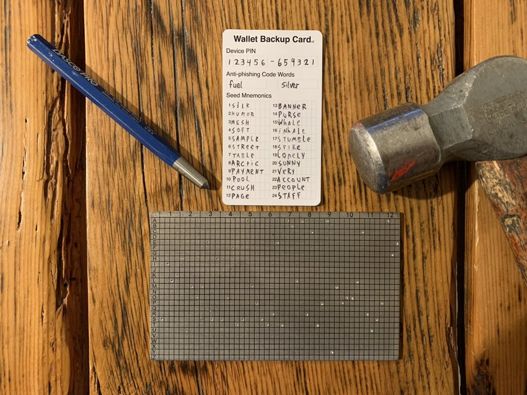
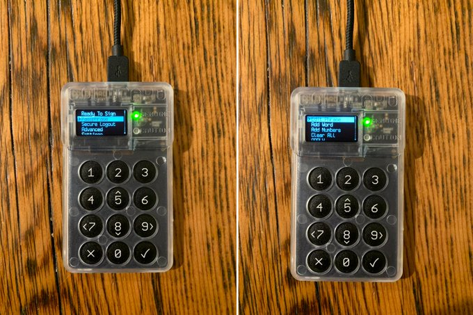
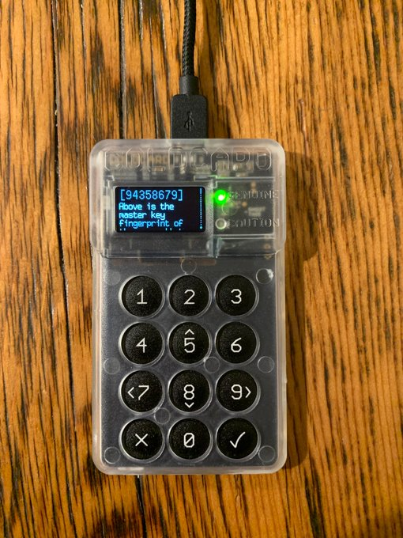
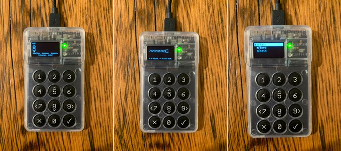

# Generating the Primary Private Key

Generate a primary private key by making a new wallet. @COLDCARDwallet will randomly generate 24 of 2048 predefined words. Add entropy to the 24 words by rolling dice to make it extra random. Write down the words, take the test to prove it, & never show the words to anyone.

  
  
  
  

 

Stamp your mnemonic seed words into a [@bitcoinbackup](https://twitter.com/bitcoinbackup) to ensure the safety of your private key in the event of a fire or flooding. Remember, this will be the primary key that all your other Bitcoin wallet keys are derived from. Keep it safe. Keep it private.

 

 

Add a BIP39 passphrase. Or "25th word", it can be anything. It's an extra protection in case someone gains access to the @COLDCARDwallet with your PIN and/or mnemonic, they won't know your secret 25th word & won't be able to spend your bitcoin. Make note of the fingerprint!

  
  
  

 
