# Deriving Entropy with BIP85

Time to derive entropy! @COLDCARDwallet can produce several key types for various Bitcoin wallets. For WIF, BIP85 stipulates this is done by "Using 256 bits of entropy as the secret exponent to derive a private key and encode as a compressed WIF..."

  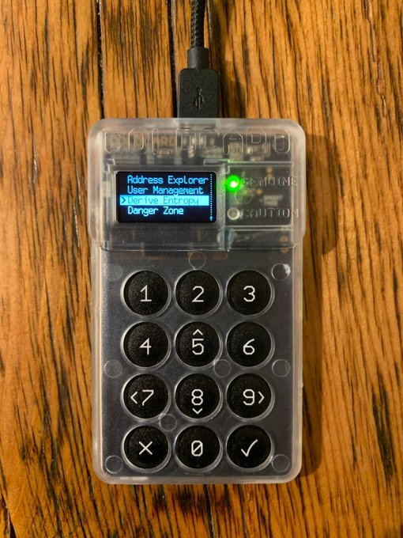
  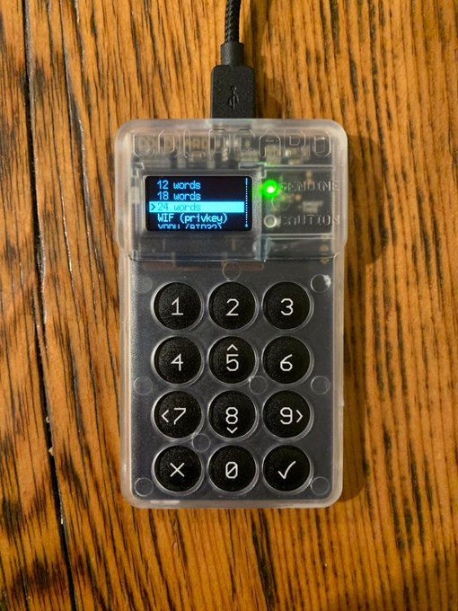
  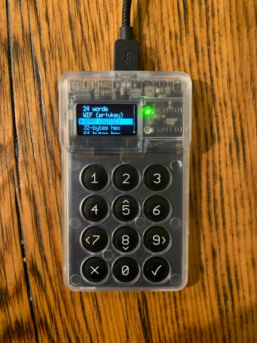

 

@bluewalletio will accept mnemonics, private keys, & WIF. In this example I used WIF. Exported from the @COLDCARDwallet to microSD. Then copy/paste into the mobile phone. I used #1000 as the index.

  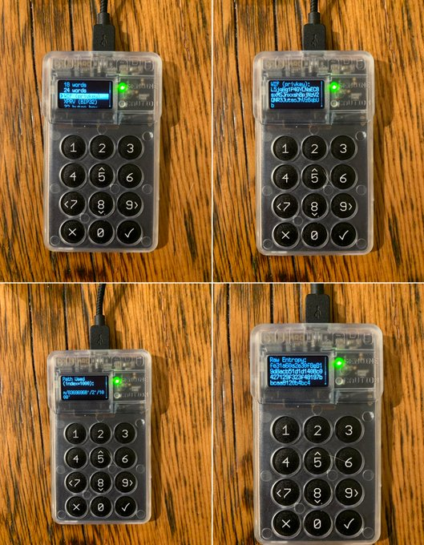
  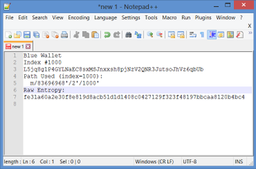
  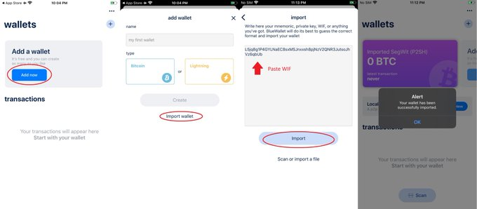

 

# Sending some BTC to the newly generated @bluewalletio.

50,000 sats for this example. After about 20 minutes it had 3 confirmations... and yes, that was at 1 satoshi/byte.

  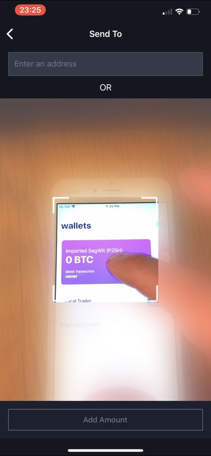
  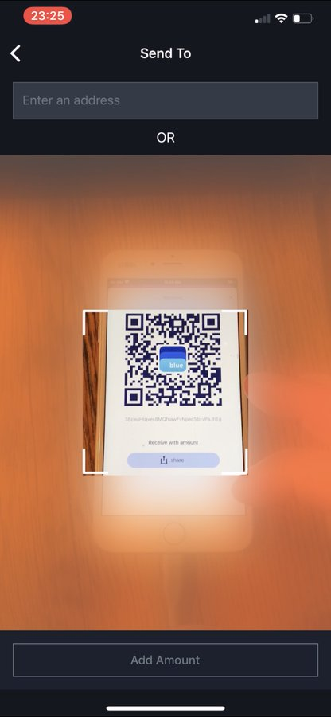
  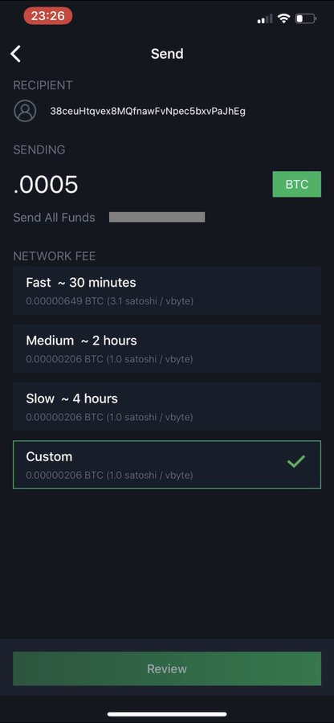
  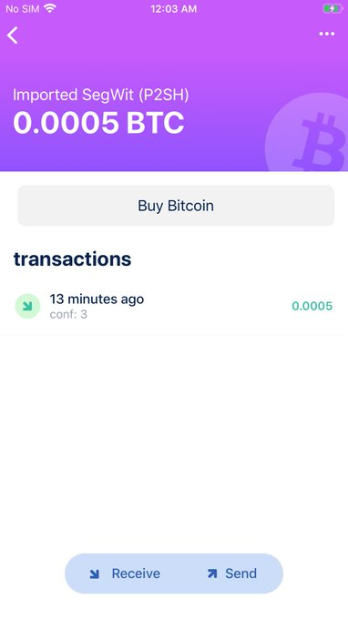

 

Export a new WIF privkey for the Bitcoin Core wallet, this time I used index #5000. Created a new blank wallet in Bitcoin Core then in the console ran "importprivkey "L2DiyrqQQq......"".

  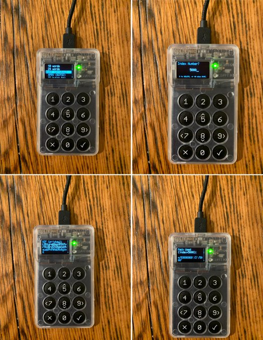
  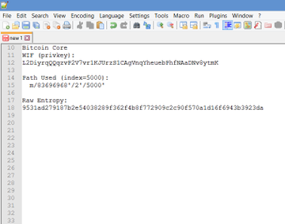
  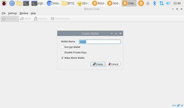
  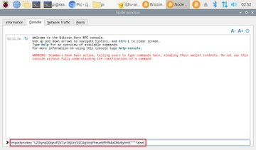

I copied the bc1... receiving address and moved the BTC to the newly generated Bitcoin Core wallet from the @bluewalletio.

  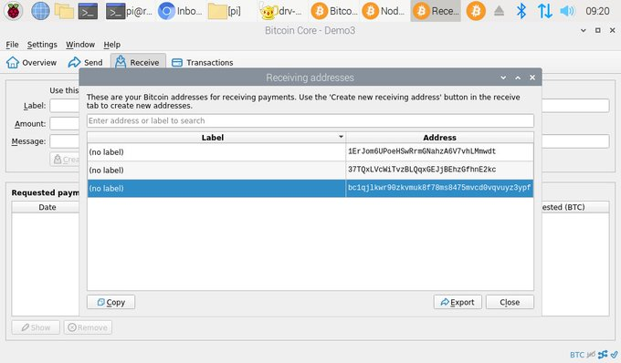
  

  

Side note, while waiting for that transaction, if you're interested in building your own Bitcoin full node on a [@Raspberry_Pi](https://twitter.com/Raspberry_Pi), here is how I built mine: https://econoalchemist.github.io/Raspi-Node-Build/

Once received in the Bitcoin Core wallet, send some BTC to @COLDCARDwallet. You can export a list of receiving addresses to a .txt file & transfer via microSD to the Raspi node then copy/paste. Bech32 addresses seem to work best for PSBT, FYI. Verify address on the CC.

  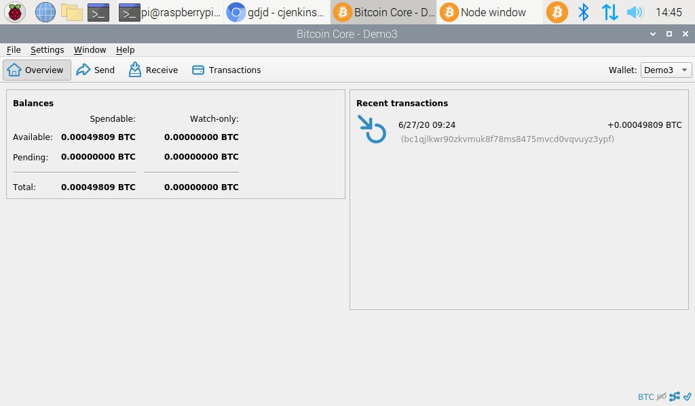
  
  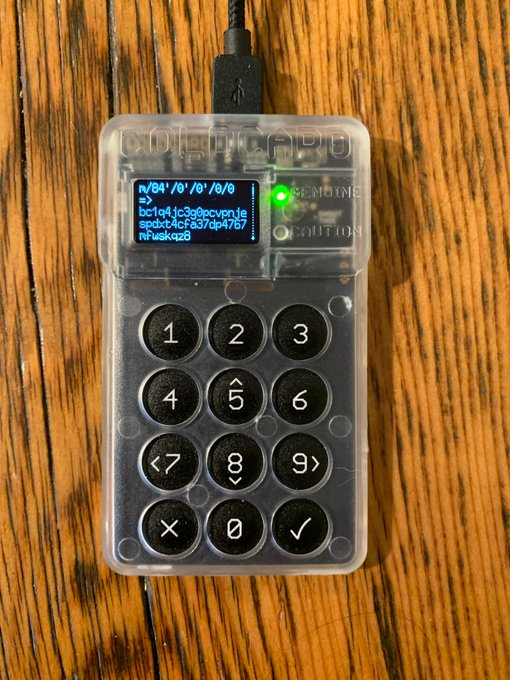
  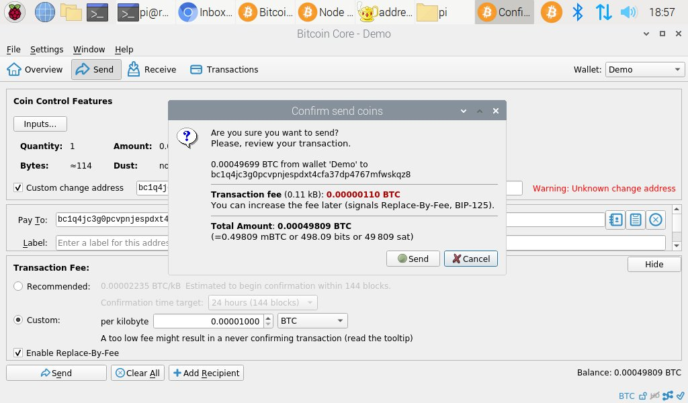

In Conclusion, showed how to set up @COLDCARDwallet, generate WIF for mobile @bluewalletio & Bitcoin Core, & moved some BTC to all 3 wallets. I hope you found some useful information here.

Check out these additional resources to learn more cool stuff about Bitcoin: 

https://coinkite.com

https://bluewallet.io

https://bitcoincore.org

https://bitcoin-only.com

https://bitcoinqna.com

# Extra credit: 
I tried importing a BIP32 xprv into Bitcoin Core with the "importmulti" command by combining info from the @COLDCARDwallet dump, import, & derived entropy files. But this was over my head & I couldn't quite get it. If you know how please share your thoughts.

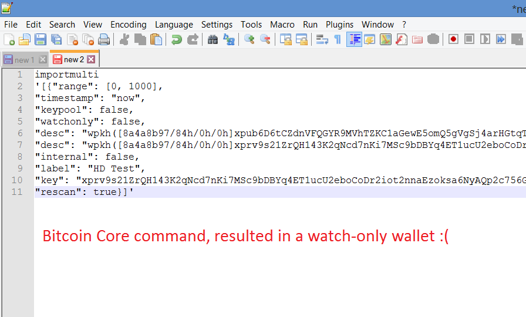

Thanks for reading! I hope this gave you some ideas about how you could possibly use a ColdCard wallet to generate keys for your other wallets.
