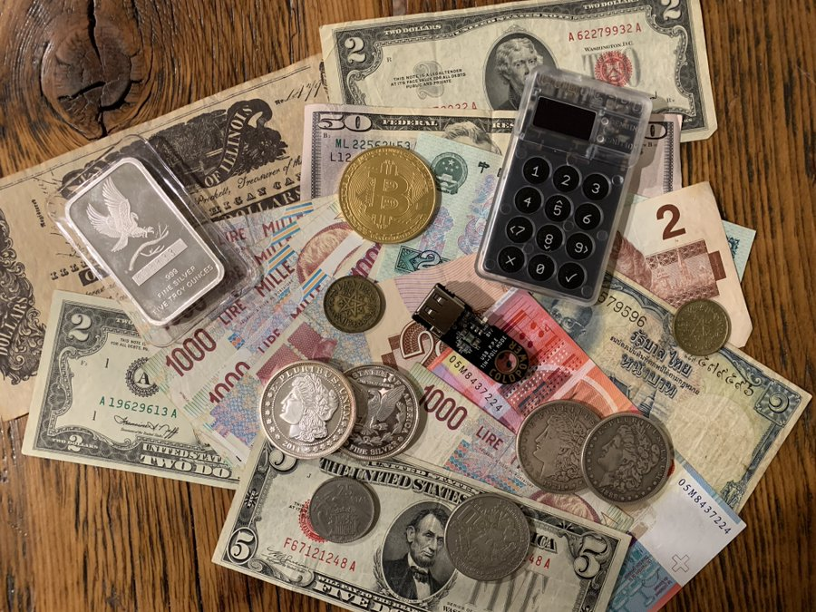

# Deriving entropy on COLDCARD wallet with BIP85
## "One seed to rule them all, One Key to find them, One Path to bring them all, And in cryptography bind them."

This article is about BIP85, setting up a [@COLDCARDwallet](https://twitter.com/COLDCARDwallet) from scratch, & using a primary seed to derive entropy for [@bluewalletio](https://twitter.com/bluewalletio) & Bitcoin Core. The cool thing about BIP85 is that it enables one to create several keys for several Bitcoin wallets from a single, primary seed. i.e., you just have 1 seed to secure and then all of your Bitcoin wallets are safe. Perfect for people who like trying several wallets, like myself. I maintain a note book with pages and pages of all the mnemonic seed words for all the wallets I have tried out. The nice thing about this method is that now the only information I need to securely backup is one master seed phrase for my ColdCard, the BIP39 passphrase, and the index numbers for each derived key. Then I can take any of the derived keys and import them to a wide range of available wallets.
